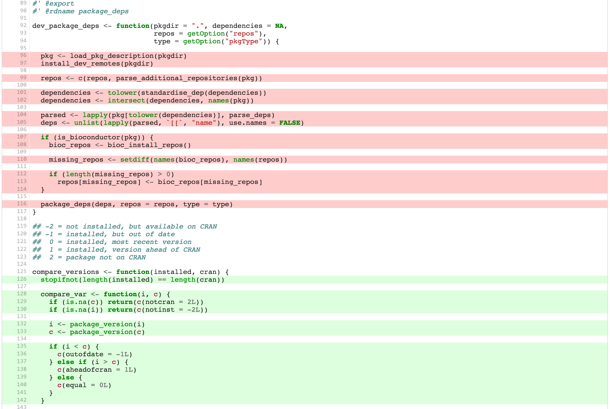

## Outline { .nonum }

<style type="text/css">
@import url("https://maxcdn.bootstrapcdn.com/font-awesome/4.6.3/css/font-awesome.min.css");
@import url("https://cdn.rawgit.com/gaborcsardi/r-font/master/rlogo.css");
</style>


1. Open source @ Mango
1. Good practices for R packages
1. Sneak peek 1: R docs in Markdown
1. Sneak peek 2: surprise

# github.com/ MangoTheCat

## Why R packages?

* Reusable code? You want an R package!
* Easiest way to distribute and install
    * R code
    * Documentation
    * Manuals
    * Data
    * Tests
* Easiest way to specify and recreate environment: other R packages,
  system requirements, R version	

## What could (should?) be an R package?

* A statistical method
* A utility function (or a collection of them)
* A data analysis project
* An ETL project
* A shiny app
* Every piece of R code that you want to run again.

# We need to improve the tools

## { .fullpage }


# Existing<br>Tools

# `R CMD check` { style="font-size: 70%" }

## { }


# `jimhester/covr` { style="font-size: 70%" }

## { }


# `jimhester/lintr` { style="font-size: 70%" }

## { .fullpage }


# `goodpractice` { style="font-size: 70%" }

## `goodpractice` features

<div class="double">
<p class="double-flow">

  <span class="icon-rlogo-alt" aria-hidden="true"></span>&nbsp;&nbsp;
  Package building advice

  <span class="fa fa-area-chart fa-fw" aria-hidden="true"></span>&nbsp;&nbsp;
  Test coverage (`covr`)

  <span class="fa fa-file-code-o fa-fw" aria-hidden="true"></span>&nbsp;&nbsp;
  Code style linting (`lintr`)

  <span class="fa fa-file-code-o fa-fw" aria-hidden="true"></span>&nbsp;&nbsp;
  Code complexity

</p><p class="double-flow">

  <span class="fa fa-check fa-fw" aria-hidden="true"></span>&nbsp;&nbsp;
  Anti-patterns, anti-functions

  <span class="fa fa-file-text-o fa-fw" aria-hidden="true"></span>&nbsp;&nbsp;
  Documentation quality (soon)

  <span class="fa fa-wrench fa-fw" aria-hidden="true"></span>&nbsp;&nbsp;
  Custom rule sets

  <span class="fa fa-cog fa-spin fa-fw" aria-hidden="true"></span>&nbsp;&nbsp;
  Use on a CI

</p>
</div>

## { }


## { }


# `xmlparsedata` { style="font-size: 70%" }

## Linting: labeled subgraph isomorphisms

Example: search for `1:nrow(<expression>)`

```
<expr>
  +-- <expr>
    +-- NUM_CONST: 1
  +-- ':'
  +-- <expr>
    +-- <expr>
      +-- SYMBOL_FUNCTION_CALL nrow
    +-- '('
    +-- <expr>
    +-- ')'
```	

## Easy with `XPath`

Example: search for `1:nrow(<expr>)`

```
//expr
  [expr[NUM_CONST[text()='1']]]
  [OP-COLON]
  [expr[expr[SYMBOL_FUNCTION_CALL[text()='nrow']]]]
```

Just convert the R parse tree to XML with `xmlparsedata`.

# R docs in Markdown

## w/o `roxygen2`

```
\name{make_style}
\alias{make_style}
\title{Create an ANSI color style}
\usage{
make_style(..., bg = FALSE, grey = FALSE, colors = num_colors())
}
\usage{
\arguments{
  \item{\dots}{\itemize{
    \item An R color name, see \code{\link{colors}}.
    \item A 6- or 8-digit hexa color string, e.g. \code{#ff0000} means
      red. Transparency (alpha channel) values are ignored.
    \item A one-column matrix with three rows for the red, green
      and blue channels, as returned by
	  \code{\link[grDevices]{col2rgb}}.
  }}
  ...
}
```

## w/ `roxygen2`

```r
#' Create an ANSI color style
#'
#' @param ... Anything of the following:\itemize{
#' \item An R color name, see \code{\link{colors}}.
#' \item A 6- or 8-digit hexa color string, e.g. \code{#ff0000} means
#'   red. Transparency (alpha channel) values are ignored.
#' \item A one-column matrix with three rows for the red, green
#'   and blue channels, as returned by \code{\link[grDevices]{col2rgb}}.
#' }

make_style <- function(..., bg = FALSE, grey = FALSE,
  colors = num_colors()) {
...
```

## w/ `roxygen2` 6.0.0 (soon)

```r
#' Create an ANSI color style
#'
#' @param Anything of the following:
#'   * An R color name, see [colors].
#'   * A 6- or 8-digit hexa color string, e.g. `#ff0000` means
#'     red. Transparency (alpha channel) values are ignored.
#'   * A one-column matrix with three rows for the red, green
#'     and blue channels, as returned by [grDevices::col2rgb].

make_style <- function(..., bg = FALSE, grey = FALSE,
  colors = num_colors()) {
...
```

# Like Shiny apps?

## { }

<div class="cover">
<iframe src="http://localhost:8888"
	style="border: none; padding:5px; width: 1024px; height: 600px;">
</iframe>
</div>

## { }

<div class="cover">
<iframe src="http://localhost:8889"
	style="border: none; padding:5px; width: 1024px; height: 600px;">
</iframe>
</div>

# How do you test this app?

## The `shinytest` package (WIP)

```r
library(shinytest)

test_that("the kmeans app updates the plot", {
  app <- shinyapp$new("050-kmeans-example")

  expect_equal(app$get_value("xcol"), "Sepal.Length")
  expect_equal(app$get_value("ycol"), "Sepal.Width")
  expect_equal(app$get_value("clusters"), 3)

  expect_update(app, xcol = "Sepal.Width", output = "plot1")
  expect_update(app, ycol = "Petal.Width", output = "plot1")
  expect_update(app, clusters = 4, output = "plot1")
})
```

## { }

<div class="cover">
<iframe src="http://localhost:8890"
	style="border: none; padding:5px; width: 1024px; height: 600px;">
</iframe>
</div>

## The `shinytest` package

```r
library(shinytest)

test_that("table is rendered and updated", {
  app <- shinyapp$new("myapp")
  expect_update(app, dataset = "iris", output = "table")
  expect_equal(
    nrow(app$get_value("table")),
    5
  )
})

```

# github.com/ MangoTheCat
